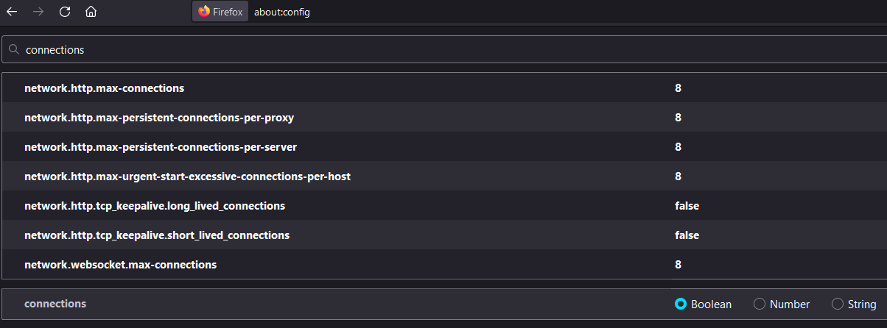

# CS3103 Programming Assignment 1 - HTTP/HTTPS Proxy

# Instructions to compile and run proxy
### 1. Install Python 3
### 2. For optimal performance, configure the following settings in Firefox about:config

### 3. Pull the Github repository to a destination local folder
### 4. On the target platforms xcne1.comp.nus.edu.sg and xcne2.comp.nus.edu.sg, run the following command:

### **python3 proxy.py <port> <flag_telemetry> blacklist.txt**

 

# Q4 Explanation
***(4pt) While running the telemetry, observe and explain the difference between HTTP/1.0 and HTTP/1.1 A way of configuring Firefox default HTTP version is explained in sec.5.1.***

It is observed from running the telemetry that there are comparatively more telemetry outputs from HTTP/1.0. These telemetry outputs also have smaller object sizes and shorter times taken to fetch.

The reason for such a behaviour is because in a default HTTP/1.0 session, TCP connection is torn down and re-established after each HTTP request and response pair, while persistent pipeling in HTTP/1.1 allows for multiple request/response pairs on the same HTTP connection.

 

# Important Design Decisions

## Language Constraints

The programming language we have chosen for this assignment was Python. Consequently, there were two language constraints we had to work with. 

Firstly, the constraint of the Python Global Interpreter Lock (GIL) in the CPython interpreter allowed only one native thread to execute at a time for each process communication, effectively limiting the amount of parallelism reachable through concurrency with multiple threads. This capped an upper bound on the data retrieval speed as we cannot utilize multiple threads for a single process. Single process sites are sites like https://www.comp.nus.edu.sg/~songch/cs3103/100mib.txt

Secondly, because of significant abstraction in the threading library in Python, there were difficulties in applying fine-grained control over the maximum keep-alive duration of each thread. This affected our proxy's ability to service new processes quickly.

## 1. Removal of persistent connections
We were unable to address the first language constraint as it was an inherent interpreter design in Python.

However, to address the second language constraint, we configured Firefox's connection settings and removed any persistent and/or long/short-lived connections. This is done to free up available threads quickly to service new incoming processes and speed up our proxy service.

## 2. Telemetry Size-Time Computation Design
For our telemetry output, we calculated the object size based on the amount of data (in bytes) returned from the web server to the client. This is because the web server is the entity returning objects to the client. 

Time-to-fetch on the other hand was computed as the duration of connection to the web server. (ie From when the client requests to when both client and server closes connection) The reason for doing so is because HTTP/1.0 has connection persistence. Assuming that we did not initially set our Firefox configuration to eliminate any connection persistence, we will not be able to get an accurate timestamp telemetry on the exact object-fetching time because part of the duration of connection may have been spent waiting for data transfer. Hence, we have to settle for a less accurate, upper bound time-to-fetch value.

## 3. Parent and Child Process Threads
In our proxy, we have one parent process thread and eight child process threads. The parent thread listens to incoming HTTP connections while the eight child threads are responsible for connections to web servers. Since the parent thread is part of the main proxy program and is not responsible for connections to web servers, we excluded it from the eight maximum threads implementation requirement of the assignment.